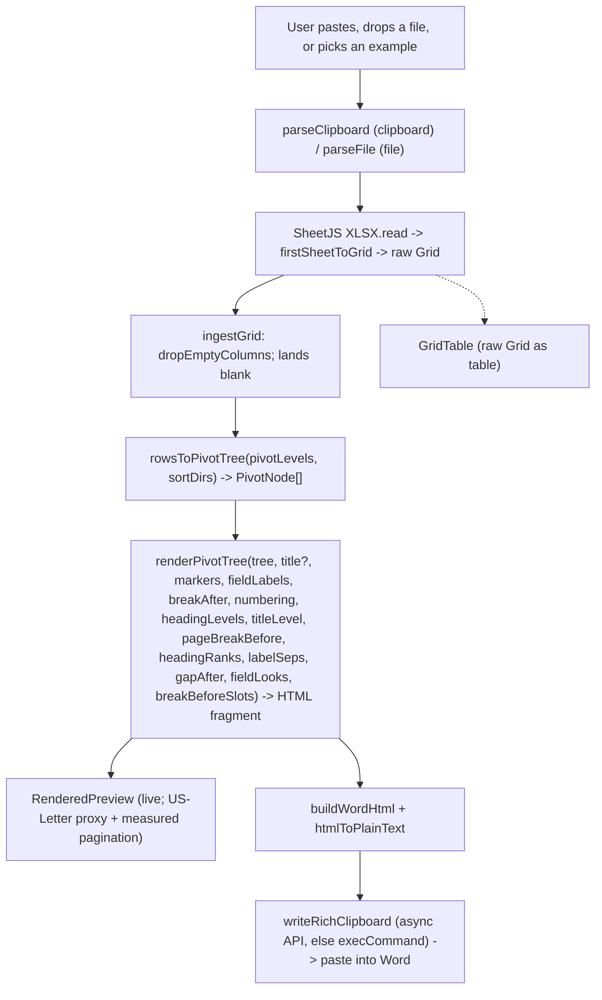

# Architecture

## Core data model

The product is a recursive **pivot tree**, not a flat table (see [`lib/types.ts`](../lib/types.ts)):

```ts
PivotNode {
  lines: PivotLine[]      // the fields at one indent level (>=1, stacked)
  children: PivotNode[]   // leaf = []
}
PivotLine { col, name, value }   // label `name` (header) + `value`, kept SEPARATE + raw
```

The parser produces a raw **Grid** (`Cell[][]`); `rowsToPivotTree` turns it into a recursive `PivotNode` tree. The builder caps indent depth at **9 levels** (`MAX_LEVELS`, the most Word renders), so beyond it a new field stacks into the deepest level rather than making a 10th. The pivot structure is an ordered list of **indent buckets** — each bucket is one indent level holding one or more fields. A node's `lines` are that level's fields stacked at the same indent (each keeps its label `name` and `value` separate so the renderer can show/hide/format the label); rows whose values match across all of a level's fields merge into one node (composite group key). The title and any level marked as a **Word heading** (`headingLevels`) map to real Word Heading styles; everything else — including any app-drawn multilevel numbers — is styled body text.

Multiple pasted tables are held as a `TableState[]` in `components/PasteInput.tsx`; each `TableState` carries its own grid, `pivotLevels` (`number[][]` — the ordered indent buckets), `markerSpecs` (`{type, delim}[]` per level — split marker counter + delimiter; a legacy fused `markers: MarkerKind[]` from older sessions is migrated on read by `resolveMarkerSpecs`), `fieldLabels` (`Record<col, FieldLabel>` — per-field label show/bold/italic/underline), `sortDirs` (`Record<col, "asc"|"desc">` — per-field sort of sibling groups), `breakAfter` (`boolean[]` — per-level "blank line BEFORE the level's line(s)"; the field name is historical — semantics went positional after the original after-own-line meaning proved indistinguishable from the group gap on leaf levels; index = level − 1, sparse → off), `gapAfter` (optional `boolean[]` — per-level "blank line after the level's WHOLE group", every group including a sole child), `fieldBreakBefore` (optional `Record<col, boolean>` — per-FIELD "blank line before this stacked field", inside the group; slot 0 is the level's own break's job), `labelSepByCol` (optional `Record<col, string>` — PER-FIELD free-text `Field name<sep>value` separator, ≤20 chars, escaped by the renderer; falls back to the brief-era per-level `labelSeps`, then ": "), `fieldLooks` (optional `Record<col, LevelInput>` — per-field LINE-look override: that field's whole line renders in an inline styled run, this section only; absent = the level's shared look), `numbering` (`{ mode: "off"|"custom"|"multilevel", start, levels }` — the Markers control: off = no marker or number, custom = each level's own marker symbol, multilevel = app-drawn static numbers with `levels` showing/hiding the number per indent level), `headingLevels` (`boolean[]` — levels mapped to a Word heading: nav pane + collapsible, Word-numbered), `headingRanks` (optional `number[]` — per-level override of WHICH `Heading K` a checked level maps to, 1–9; 0/absent = auto-contiguous), `sectionTitle`, and two more optional fields: `headerRow` (0-based index of the header row, default 0 — everything reads `bodyGrid(t) = grid.slice(headerRow)` so banner/title rows above the header are ignored; it only drops leading *rows*, so the column-keyed `pivotLevels`/`fieldLabels`/`sortDirs` stay valid) and `pageBreakBefore` (when on, each top-level group after the first starts on a new Word page). Both are optional, so older `localStorage` sessions / `.json` imports stay compatible (consumers use `?? default`). `components/tableModel.ts` `tableToHtml(t, titleLevel)` runs the per-table nest→render pipeline on `bodyGrid(t)` (threading `sortDirs` into the mapper, `breakAfter`/`numbering`/`headingLevels`/`titleLevel`/`pageBreakBefore` into the renderer) and is the single source used by both the right-pane preview and the per-section export, so both stay identical.

**Blank-by-default ingest.** Every new section lands with `pivotLevels: []` — the outline is built by adding fields one at a time. Two ingest assists were shipped here and then removed on user feedback: a Smart Arrange heuristic that auto-placed every column, and an exact-`headerSignature` “reuse that arrangement” banner. Both front-loaded structure the user then had to unpick; the **style preset** (below) took over the recurring-report job — formatting replays, structure is rebuilt.

**Style preset.** `lib/stylePreset.ts` saves the app's FORMATTING as a replayable "parser config" — the recurring-report answer for "same house style, different table every week" (e.g. `1.0 TITLE / 1.1 SUBHEADING / 1.1.1 TEXT`). Everything in a preset is either GLOBAL (`levelStyles`, `titleInput`, `headingStyleName`, `lineSpacing`; `bodyFont` is written as the fixed "Aptos" for transparency, and a legacy `indentInput` in an old file is ignored — indentation is derived) or **LEVEL-indexed** (`markerSpecs`, `numbering`, `headingLevels`, `headingRanks`, `breakAfter`, `gapAfter`, `sepsByLevel`/`looksByLevel`/`breaksByLevel` (per-(level, stack-slot) projections of the per-field separators, look overrides, and between-stacked breaks), `pageBreakBefore`) — never column-indexed — so it transfers between documents whose headers share nothing. Structure (`pivotLevels`) and per-column sort (`sortDirs`) are deliberately excluded — they are column-indexed and don't transfer across table shapes. The Rows-card LABEL emphasis (`fieldLabels`, also column-indexed) IS carried, via a level-keyed projection: `labelsByLevel[i][j]` = the label look of level i+1's j-th stacked field, applied on import to each section's placed fields by the same [level][slot] position (`applyLabelsByLevel`; a slot past the source stack reuses the last entry; fields added after the import start from the default label look). `buildStylePreset(globals, active)` snapshots the globals + the ACTIVE section's level-keyed settings (markers normalized via `resolveMarkerSpecs`) into a versioned `{app, kind: "style-preset", version, data}` envelope; `parseStylePreset` strictly gates on the envelope (so a workspace backup can't be fed in) but reads fields leniently (`?? default`, so partial presets load). PasteInput's `exportStylePreset`/`handlePresetFile` (⚙ Document popover → **Style preset** Export/Import, plus two Ctrl+K commands) download/read a local `.json` (no backend); import `commitPending()`s first so the whole application is ONE undo step, applies the globals through the guarded setters (allow-listed `lineSpacing`), and patches EVERY section with a `structuredClone` of the level-keyed settings (`markers: undefined` drops the legacy fused field). Sparse level arrays are read `?? default` everywhere downstream, so a 3-level preset on a 5-level table (or vice versa) degrades safely.

## The pivot view (how a Grid becomes a tree) — `rowsToPivotTree`

Row 0 is field names. You arrange fields into an **ordered list of indent buckets** (`pivotLevels: number[][]`): bucket 1 is the outermost level, within each group nest by bucket 2, and so on. A bucket can hold **one or more** fields — fields stacked in one bucket render at the same indentation and form a **composite group key**, so rows merge into one node only when they match across every field in that bucket. Each line is labelled `Field name: value`; per field, the label (`Field name: `) can be hidden, bolded, or underlined (`fieldLabels`), leaving just the value. A per-field **sort** (`sortDirs`) reorders the sibling groups at that field's level (ascending/descending, numeric + text aware via `localeCompare` with `numeric:true`); off keeps first-seen order. A per-table **Markers** control (a 3-mode dropdown: **Off** = no markers or numbers / **Custom** = each level's own bullet/number symbol / **Multilevel** = app-drawn static numbers; default **Off** — a fresh paste carries no preset formatting) sets the body's marker style. In **custom** mode a per-level marker picker chooses each level's bullet/number style (only the first field of a multi-field level is marked); **off** shows neither marker nor number. In **multilevel** mode the renderer prefixes each node's first line with an app-drawn static number from a chosen `start` (a dotted-decimal string = the exact first item number; `5.1` → `5.1.1` → `5.1.1.1`) and suppresses that node's marker; a per-level checkbox (`numbering.levels`) hides a level's number, making it TRANSPARENT — its children continue the nearest shown level's sequence, so the numbers follow the gap (`5.1` → `5.1.1`, `5.1.2`, never a number under a hidden parent) with no collisions (`multilevelNumbers`). The matrix's **Line break before** column (`breakAfter: boolean[]`, level-indexed — historical name) pushes a spacer paragraph right BEFORE that level's line(s); its companion **Line break after** column (`gapAfter: boolean[]`) pushes the spacer after the level's WHOLE subtree (`…8.2 x` → blank → `9 Region`), on every group including a sole child (the old between-siblings-only rule silently no-opped on one-group-per-parent levels); stacked sibling sub-rows add a per-FIELD **Line break before** (`fieldBreakBefore[col]`) between the stacked lines inside a group (`1.1 Country` → blank → `Product`). A spacer post-pass collapses adjacent blanks to one and trims both document edges, and a **New page per group** checkbox (`pageBreakBefore`) marks the first line of each top-level group after the first with `data-break="1"`, which `buildWordHtml` turns into a `page-break-before:always`. Blank cell → `(blank)`; first-seen order preserved at every level (before sorting).

```
1. Item Category: Fruit
   a. Item Name: Apple
        i. Item Qty: 16             ← bucket 3 holds three fields,
           UID: AVASCASC               stacked at one indent
           Item Description: Lorem…
   b. Item Name: Banana
        …
2. Item Category: Meat
   …
```

Output is a `PivotNode[]` (recursive; the builder caps indent depth at 9 levels; each node carries its level's `lines`). The optional **Section title** renders as `<p class="ws-title">` and the nested rows as `<p class="ws-lvl" data-level="N">` (depth clamped at 9); a line-break spacer is an extra `<p class="ws-lvl" data-level="N">&#160;</p>` (an nbsp so Word keeps it; no marker/number/label) — before a node's lines, between stacked lines, or after a subtree, per the three break options; a post-pass collapses adjacent spacers into one and trims the document's edges. When numbering is on, a node's first line is prefixed with its compounded number as plain escaped body text (the number replaces the marker). A level the user marks as a **Word heading** tags its first line `data-heading="K"` — K is **sequential by default**: one rank under the previous heading level (the title — gated on a title actually existing — then each heading-checked level in depth order, **pinned values included**, clamped 9), so checking levels 1 and 4 gives H2 → H3 under a Heading-1 title (never a skipped H2 → H5 outline) and pinning a level re-derives the autos beneath it (pin H1 → the next auto is H2). An explicit `headingRanks[depth-1]` (1–9; 0/absent = auto) **overrides** the rank for templates whose numbering keys off a specific heading (several levels may share one rank) — a pin is the only way a rank gap can occur. The level owner's Heading checkbox shows the resulting rank as a small **chip-dropdown** (Auto / pin H1–H9, amber-tinted when a manual pick skips a rank — Word's accessibility checker flags gapped outlines), and that level's Marker/Number cell collapses to a *Word numbers* note (its own marker/number is suppressed, so a live control would lie). `buildWordHtml` maps the **title** (and any heading-marked levels) to the destination `Heading 1`/`Heading K` styles when set (a Use-Destination-Styles or default Ctrl+V paste adopts them — `5.0`, `5.1` — so the heading rows enter the nav pane and become collapsible; Keep Source Formatting keeps the preview look instead); every other body row (spacers, numbered/markered lines) uses the app's direct per-level styling, so the Word output matches the live preview. With a title the nested data starts at level 2; without one, level 1. The builder (`components/TableCard.tsx`) is **three cards split by SCOPE** — the split is deliberate and is what keeps the two kinds of formatting legible: the Rows card's `B`/`I`/`U` touch **only the label** (the text before the colon, via `wrapLabel`), whereas a level's **Look** restyles the **entire line** (label AND value). An earlier revision merged them into one dense row and it read as ambiguous — three scopes side by side with lookalike controls.

1. **Section Definition** — title text, the Word-heading dropdown (incl. **Custom style…**), and the shared title Look.
2. **Fields & Title Definition** (per FIELD, this section) — the Add-fields pool plus **one row per field**, drawn with Windows-Explorer-style tree connector lines │ ├ └, with a live **N/9 levels** chip + at-cap warning enforcing the 9-level ceiling. Arranged with the **◀ outdent / ▶ indent / ▲ ▼ reorder (`moveField`) / ✕ remove** buttons — the default and always-available path. *(A first drag-and-drop pass — a ⋮ handle + gap drop-zones over a `placeColumn` reducer that could also indent/stack — was REVERTED as ambiguous. Drag returned later as an OPT-IN preference — a `role="switch"` toggle in the Rows card header (`dragRows`, persisted in the `SessionSnapshot` but excluded from undo history like `activeId`): a ⋮ grip per row, **vertical-only** by construction — `reorderField(levels, from, to)` splices the flat field order and pours it back into the SAME bucket shape, so a drop reorders but can never indent, outdent, or stack. While it's on, the ▲ ▼ buttons hide (the grip replaces exactly that job); ◀ ▶ ✕ remain.)* Any change **flashes the affected row** (`flashRow`/`applyMove`: an accent tint for ~1.1s, the timer re-armed on each change so a burst of clicks reads as ONE continuous highlight rather than a stutter, and inert under `prefers-reduced-motion`) — reordering shifts a row out from under the cursor, which otherwise makes a field easy to lose. Per-field controls sit on every row: the label toggles (Aa show/hide, B bold, I italic, U underline) and sort (↕/↑/↓). Field names are plain UI text (a styled "live micro-preview" with a sample value from the first data row was removed on feedback — it read as noise next to the real right-pane preview); a stacked sibling (`k > 0`) shows a blank number pill at its owner's indent (the tree guides carry the nesting).
3. **Body Text Definition** (per LEVEL) — the per-table **Markers** mode + Start and the **New page per group** checkbox, then a compact matrix, one row per indent level, one SUB-ROW per field (stacked levels number their rows `2.1`/`2.2`; pills match the Fields card) with columns **Level | Marker | Label sep | Line break before | Line break after | Heading | Look** — Marker/Heading and the level's own line breaks are LEVEL-scoped on the first sub-row; Label sep is per FIELD, a stacked sibling's **Line break before** cell is a per-FIELD between-stacked-lines break (`fieldBreakBefore`), and Look is the level look (all tables) on the first sub-row vs a per-field override (this section) on stacked siblings. Scope is mixed on purpose and marked per column (Marker + Heading are per-table; the Look is global by depth). The Marker cell is a **Type** select `1/a/A/i/I/•/–/None` × a free-text separator input (any string ≤20 chars, escaped; disabled for symbol/none types) in Custom mode; in Multilevel a **Show number** checkbox, hidden in Off, and an italic *Word numbers* note on a heading-mapped level. The delimiter's no-delimiter option is labelled **"None"**, not an em-dash — a "—" glyph read like a character you'd actually get. The **Heading** cell is a checkbox + Auto/H1–H9 rank chip. The **Look** cell is a color swatch + an **Aa▾** popover (font / size / **B** / **I** / **U**), rendered by the shared `LookControl` that ALSO renders the Section Title's Look, so the two read as one system (Word's one-Modify-Style-dialog model). Every control stays visible — no progressive disclosure — so the whole format is adjustable at a glance and 9 levels still fit on screen.

The line-break controls are the matrix's **Line break before/after** columns (`breakAfter[i]`/`gapAfter[i]`, this-section scope; stacked siblings carry the per-field `fieldBreakBefore`). The Look control edits the shared per-depth body look (GLOBAL, all tables; the per-depth slot is `bucket + (sectionTitle ? 1 : 0)`, matching the renderer), while only the document-wide Line-spacing and Reset-levels controls (plus the Style preset) sit in a compact **⚙ Document** popover in the top command band, badged *All tables*. `PasteInput` owns the styling state; it threads the per-depth level styles to `TableCard` as a slimmed `appearance` prop (`{ levelStyles, onLevelChange, bodyFont }`; `LevelInput`/`DEFAULT_LEVEL` live in `components/tableModel.ts`) for the Look column and drives line spacing / reset itself in the Document popover, so level styles stay global-by-depth while markers/heading/line-break/numbering stay per-table. **An untouched level's font INHERITS the fixed base font** — Aptos 11 (`LevelInput.font: "" = inherit`, resolved in the `headingStyle` memo via `ls?.font || BODY_FONT`; the document-wide Body font CONTROL was removed on feedback, so the base can't drift per document); the Look popover's font select leads with a "Body font (Aptos)" option that un-pins a level back to inherit. A dependency-free `Popover` helper (`components/Popover.tsx`) anchors both each Look panel and the Document popover, and `TableCard` exports `FONTS` (the allow-listed font list) for `PasteInput` to reuse.

**Outline indentation (derived).** Indentation is not a setting — it is DERIVED from the numbering geometry, the way Word's own multilevel lists nest ("legal numbering"): each level's line indents to its PARENT'S TEXT POSITION — the parent's indent plus the MEASURED width of the parent's lead — so `1.1.1` starts exactly under `Name` however wide the numbers grow; a lead-less line (numbering off, hidden number, heading) advances the chain by a fixed 0.25in step (Word's list convention), and the old ⚙ Indent-per-level control was removed. Every lead line hangs: the renderer wraps its lead in `<span class="ws-lead">` and tags the line `data-hang` (stacked continuation lines `data-cont`); `buildWordHtml` walks the paragraphs in document order with a per-depth text-position chain, measuring each lead with a cached canvas at the font/size/bold it actually renders in (a field-look override's span wins over the level style; a per-glyph estimate covers headless runs), strips the tag, and emits margin-left = parent-text-pos + width with `text-indent:-width` (spacers keep their indent but never advance the chain; heading rows render flush-left yet still advance it for their children); `RenderedPreview` mirrors the identical walk in a LAYOUT effect — DOM-measured, applied before paint, re-applied on resize and after fonts settle. So wrapped text and stacked fields land flush with the first field's text at every depth, preview and paste agree to sub-pixel, and it is all inline direct formatting — it survives every paste mode.

## Data flow

```
clipboard (text/html, else text/plain)  — OR —  dropped/picked file (.xlsx/.xls/.csv/.tsv, via parseFile)
  -> SheetJS XLSX.read (type:"string" for clipboard, type:"array" for a file) -> firstSheetToGrid
  -> sheet_to_json({ header: 1, blankrows: false, defval: "", raw: false })   -> raw Grid
  -> dropEmptyColumns(grid)   (strip fully-blank spacer columns on ingest)
  -> append a BLANK TableState (fields are added one at a time)
  -> tableToHtml(t, titleLevel):
       rowsToPivotTree(bodyGrid(t), pivotLevels, sortDirs)   (bodyGrid = grid.slice(headerRow); build first-seen, then sort-post-pass)
         -> renderPivotTree(tree, title?, markers, fieldLabels, breakAfter, numbering, headingLevels, titleLevel, pageBreakBefore, headingRanks, labelSeps, gapAfter, fieldLooks, breakBeforeSlots)  -> HTML fragment
  -> live preview (RenderedPreview, dangerouslySetInnerHTML; scoped [data-level] CSS)
  -> buildWordHtml + htmlToPlainText -> writeRichClipboard                    -> paste into Word
```

**Copy section** is the export: it runs the active table's `tableToHtml` fragment through **one** `buildWordHtml` (a single `@page`) and writes it to the clipboard — each section is its OWN standalone Word document, not stacked with the others (there is no combined "Copy all", and no combined "All sections" preview). **Ctrl/Cmd+Enter** triggers it from anywhere (a window keydown listener with the same latest-handler-ref pattern as paste-anywhere — the mouse-free way out, pairing with paste-anywhere's way in). `tableToHtml` also powers the live preview, so preview and export stay identical. On success `copySection` sets a `copyNote` that renders as a visible + `aria-live` banner ("Section copied." + the Keep-Source-vs-Use-Destination paste guidance); `renderPivotTree` escapes all user-derived text (`& < >`). The **Table** view (`GridTable`) shows the raw parsed Grid as an actual HTML table (as pasted, before restructuring) instead of the rendered tree — the right pane has exactly two tabs, **Preview** and **Table**. (A third raw-**JSON** tab and its `JsonPreview` component were removed: it showed nothing a developer couldn't get from devtools. The former in-view **Header row** picker was likewise removed by request; a legacy session's stored `headerRow` is still honored on read via `bodyGrid`.)

**Intake + command surfaces.** `components/AddTableModal.tsx` is the ＋ Add-table modal — a portaled, Escape/backdrop-dismissable dialog (mirroring `Popover`) whose two phases are keyed off whether a grid has been read: **intake** (a drop well accepting a window `paste`, a file drop / Browse routed through `parseFile`, and a Try-an-example link) → **preview** (a "Read N × M" summary + a mini-table + **Add section** / **Clear**), so a mis-copy is caught before it becomes a section. It owns no parsing or ingest of its own: the parent injects `parseClipboard`/`parseFile`, and `onCommit(grid)` routes to the existing `ingestGrid` (reusing every downstream guard — `dropEmptyColumns`, the section cap, the arrangement-reuse offer); while it is open `PasteInput`'s global paste listener bails (via `addModalOpenRef`) so there is no double-ingest. It replaces and RETIRES the old inert `pasteZone`; paste-anywhere remains the ambient path. `components/CommandPalette.tsx` is the **Ctrl/Cmd+K** launcher — a portaled centered modal, case-insensitive **subsequence** fuzzy match, grouped by `section` (the no-section bucket lifted first), full in-input keyboard nav (`aria-activedescendant`, arrows/Enter/Escape handled on the input rather than a global listener), and shortcuts shown as `kbd` chips. The parent owns the shortcut + builds the `commands` array from its existing handlers (Add table, Copy section, Duplicate/Remove section, Undo/Redo, Document settings, Clear all, and a "Go to section" per table), so every command inherits undo/redo and the confirmations; disabled entries stay visible but unselectable. It is keyboard-only (Ctrl/Cmd+K) — a top-band ⌕ button existed and was removed as visual noise.

**Living page preview.** `RenderedPreview` presents the active section's fragment on a **true-to-scale US-Letter proxy**: a white paper div padded with proportional 1in margins (fractions of the paper WIDTH, since CSS % padding is width-relative — `MARGIN_FRAC = 1/8.5`), so text wraps in a ~6.5in column. A layout effect + `ResizeObserver` measure the paper width and content `scrollHeight` and compute `pages = ceil(contentH / (width · 9/8.5))` (`PAGE_BAND_FRAC`); when > 1 it overlays a dashed **"Page N"** boundary at each usable-band multiple (absolutely positioned, `pointer-events:none`, so it never affects the measured height). (A green/amber page-fit chip sat above the paper and was removed as noise — the ~N-pages stat beside the view tabs and the drawn boundaries carry the answer.) A muted **"Showing: your Keep-Source look"** label (tooltip: a Use-Destination-Styles paste adopts the template's Heading styles instead) sets expectations. It is a best-effort ESTIMATE — Word wraps in the destination font, so the real break can shift a line or two, and the app does not claim pixel-exact parity — and only a LAYOUT wrapper: the `tableToHtml → renderPivotTree` fragment and the scoped per-level `<style>` are unchanged.

**Persistence.** `PasteInput` memoizes a `SessionSnapshot` (`{tables, levelStyles, headingStyleName, titleInput, activeId, lineSpacing?, dragRows?}` — plus legacy `bodyFont`/`labelSep`/`indentInput`, read-ignored so older sessions/exports still load) and writes it to `localStorage` via `lib/persistence.ts` (versioned envelope) — debounced 400ms, plus a synchronous flush on `pagehide`/`visibilitychange` — and rehydrates once on mount behind a `hydrated` gate (re-seeding the `idRef` id counter past the largest restored id, so the first client render matches the empty server render and there’s no hydration mismatch). It is local-only; nothing is uploaded. **Undo/redo covers every change** — an effect observes the `SessionSnapshot` memo and records a step whenever a workspace field other than `activeId` changes (coalescing rapid bursts via a short debounce), with `Ctrl+Z` / `Ctrl+Y` and persistent toolbar buttons; **duplicate** (`duplicateTable`, a `structuredClone` spliced in after the source) and **paste-anywhere** (a window `paste` listener, `ingestClipboard`, that ingests unless a text field is focused) both run through the same state so they're captured too; **Try an example** injects `makeExampleTable`. `newTable(id, grid)` in `components/tableModel.ts` is the one default-`TableState` factory shared by paste and the example.

## Clipboard output

`lib/clipboard.ts` wraps the rendered fragment for Word and applies the styling:
- `buildWordHtml(fragment, heading, bodyFont)` → an Office-namespaced `<html>` with `ProgId`/`Generator`/`Originator` metas (what Word's own clipboard writer emits — marks the payload as WORD-DOCUMENT content so Word offers its between-documents paste options, incl. **Use Destination Styles**, even in a blank destination where no conflicting style is in use), a `<style>` (`@page`, body font, the heading rules actually used) and `<body>{rewritten fragment}`. **Heading mapping is by REAL `<h1>`–`<h6>` elements whose rule declares the FULL source look** — the mechanics were verified empirically against desktop Word (COM paste matrix, July 2026): (1) a **Use Destination Styles** or **default Ctrl+V** paste maps `<hK>` to the built-in `Heading K` in a blank doc AND a template (an alias like `1.0 HEADING` resolves) — everything DECLARED in the `hK` CSS rule is treated as the source style's DEFINITION and swapped wholesale for the destination style (clean adoption), while anything NOT declared falls back to Word's HTML h-defaults and rides along as polluting DIRECT formatting (a bare `<h1>` pastes as Heading 1 + direct bold 24pt) — so each rule declares `mso-style-name`/`mso-outline-level` PLUS the level's color/font/size and bold; (2) a **Keep Source Formatting** paste never maps named styles — the row lands as **Normal** with `mso-outline-level` as direct formatting (still in the nav pane, the deceptive half-working symptom) and the declared rule look IS the visible formatting, so KSF now shows the preview's bold heading look instead of naked body text (this was the original blank-doc bug: heading rows carried no look at all, so a KSF paste produced plain Normal text); (3) **Merge Formatting** strips both the mapping and the outline level — the copy banner warns against it. The paste never redefines the destination's own Heading styles. **The title:** when `headingStyleName` is a built-in `Heading 1–6` (all the dropdown offers) it becomes `<hN>` (N via `headingLevel(name)`, so Heading 2/3/4 land at the right outline depth); any other non-empty name keeps the legacy `<p class="MsoTitle">` + `mso-style-name:"<name>";mso-outline-level:<N>` rule. Either way `wrapTitleOnHeading` emits the title's font/size/color inline (one `<span>`, wrapped by `<i>`/`<u>` runs) and its WEIGHT only in the title's style rule — no inline `font-weight` at all (bold is an OOXML toggle; the old inverted-weight trick pasted backwards under Keep Source Formatting). COM-verified outcome for a MAPPED title: **KSF = the exact preview look** (inline + rule), **UDS = the destination heading's complete look** (font, size, weight — Word's style recovery strips direct formatting on style-mapped paragraphs, plus the auto-number, nav entry, and spacing). Blank/None → the app's own `titleStyle` look inline in full, including a literal `<b>` run. **Heading-marked rows** (`data-heading="K"`) become `<hK>` for K ≤ 6, so they enter the destination outline (nav pane + collapsible) and Word numbers them — in blank docs and templates alike; K 7–9 (no HTML tag) keep `<p class="MsoHeadingK">` with the same rule declarations (the class route maps on the same Use-Destination-Styles/default pastes — and, like the tag route, never under KSF). Each heading rule's declared look is the LEVEL's look (keyed by the row's `data-level`, same as the preview's heading rows; the mapped title's rule declares `titleStyle`). Style rules are emitted only for what the fragment actually used (a blank title adds no stray `p.MsoTitle` rule). **Every other body row** (including spacer paragraphs and any app-drawn multilevel numbers, which are already plain text in the fragment): a `<p>` with **inline** direct formatting — `heading.levels[N-1]` (color/font/size) + left-indent + compact spacing (`margin:0`, `line-height:115%`) — with `<b>`/`<i>`/`<u>` runs for the label per `fieldLabels` (underline wraps just the name, not the `: ` separator). A row carrying `data-break="1"` (a top-level group starting a new page under **New page per group**) also gets `page-break-before:always` — appended to the body paragraph's inline style, or added as a `style=` alongside the `MsoHeadingK` class when that same row is also a Word heading. The body-row regex is `data-level="([1-9])"( data-break="1")?(?: data-heading="([1-9])")?`. Inline (not a CSS class) is the key: a Use-Destination-Styles paste discards class/style-name formatting it can't map (resetting unknown classes to Normal, dropping bold and bringing Normal's space-after) but keeps inline direct formatting + inline runs, so the per-level look, tight spacing, and label bold/italic/underline survive and match the live preview. The browser writes the Windows CF_HTML header automatically.
- `htmlToPlainText(fragment)` → readable plain-text fallback for the `text/plain` flavor.
- `writeRichClipboard(html, plain)` → puts both flavors on the clipboard, returning whether it landed. It tries the **async Clipboard API** (`navigator.clipboard.write` + `ClipboardItem`) and, if that is unavailable or throws, falls back to **`execCommand("copy")`** with a capture-phase `copy` listener that overwrites the payload — the pre-async-API way to place real HTML (not just text) on the clipboard. The fallback briefly selects an off-screen node (positioned off-canvas, since `display:none` cannot be selected) and restores the user's own selection afterward. This is what makes the **single-file build** viable: the async API requires a secure context and a clipboard permission, and a page opened by double-clicking a `.html` (origin `null`, no HTTPS) is exactly where a browser or a managed-browser policy is most likely to refuse it. Copy is the app's entire payoff, so it must not depend on a single API. Must be called synchronously from a user gesture.

## Single-file build

A **second build target** alongside Next.js, which remains the dev path and is untouched by it. `npm run build:single` (Vite) emits **one self-contained `dist-single/index.html`** (~660 KB) with React, SheetJS, the compiled CSS and all app code inlined — **zero external requests** — so it runs from a `file://` double-click with no server, no install, and no network. It works only because the app is 100% client-side (no API routes, no server components, no data fetching).

- **`index.html` / `main.tsx` / `vite.config.ts`** (repo root). `main.tsx` is the Vite counterpart to `app/layout.tsx` + `app/page.tsx`: it mounts the same `PasteInput` into `#root` and imports the same `app/globals.css`, so both builds render identical UI from one source. Next.js never reads `index.html`.
- **`viteSingleFile()`** inlines every JS chunk and stylesheet into the HTML.
- **Two `file://`-specific choices, both load-bearing.** (1) The bundle is emitted as an **IIFE** (`rollupOptions.output.format: "iife"`) and a small post-build plugin strips `type="module"` off the inlined script tag — module scripts are subject to CORS rules an opaque `file://` origin cannot satisfy. Safe only because an IIFE bundle contains no `import`/`export`/`import.meta`. (2) Because a **classic** script in `<head>` executes IMMEDIATELY (module scripts are deferred; classic ones are not) and Vite hoists the entry there, `main.tsx` waits on `document.readyState === "loading"` → `DOMContentLoaded` before mounting. Without that guard `#root` does not exist yet and the page renders blank — the exact symptom the first build shipped with.
- **Tailwind needs no extra plugin**: Vite auto-loads the repo's existing `postcss.config.mjs`, which already runs `@tailwindcss/postcss`. One CSS pipeline, shared by both builds.
- **No webfonts**: `app/layout.tsx` deliberately does not use `next/font` (the app's stack is Segoe UI + Cascadia Code/Consolas), which is what lets the single file stay fully self-contained — a `file://` page cannot fetch a font CDN.
- New devDependencies are **build-time only** (`vite`, `@vitejs/plugin-react`, `vite-plugin-singlefile`); nothing ships to users, and SheetJS is still the official CDN tarball.
- `dist-single/` is gitignored. Distribute the one file on a shared drive; email filters commonly strip `.html` attachments.

`HeadingStyle = { levels: LevelStyle[]; headingStyleName: string; titleStyle: TitleStyle; lineSpacing?: number; indentStep?: number (LEGACY, ignored) }` is the single styling source, built once in `PasteInput` (its per-level look is edited in the **Look** column of `TableCard`'s **Level formatting** card, and its line spacing / reset in the **⚙ Document** popover in `PasteInput`'s top command band, badged *All tables*) and shared by every table — `headingStyleName` is the Word style name for the title (default `""` = None — a new workspace applies no mapping until chosen; options `None`/`Heading 1–4`/**Custom style…** — the custom mode reveals a text input for ANY destination style name, e.g. `TBL_TITLE`, sanitized by `sanitizeStyleName` (letters/digits/space/`._-`) and mapped via the legacy `p.MsoTitle`+`mso-style-name` route, which requires the style to exist in the destination and a Use-Destination-Styles paste; blank/`None` = the app's own `titleStyle` look inline). `lineSpacing` (1/1.15/1.5, default 1.15) emits as `line-height:N%` in both the preview (an unlayered `.ws-preview p` rule) and every pasted paragraph. Label separators are PER FIELD on each table (`labelSepByCol`, free text ≤20 chars, escaped in `wrapLabel`; the legacy per-level `labelSeps` is read as a fallback and the old document-wide `labelSep` is ignored). Underline still covers only the name, never the separator. `PasteInput` turns that name into a number via `headingLevel(headingStyleName)` (1–9, or 0 for None) and threads it as `titleLevel`, so a mapped title lands at its chosen `mso-outline-level` (Heading 2/3/4 give a correct outline, not a hardcoded 1) and its full `titleStyle` Look (font/size/color/bold/italic/underline) applies inline on top, while body-heading rows nest at `titleLevel + depth`. `levels` is the direct per-level look used for body rows (11pt black; font = the ⚙ Body font unless a level's Look pins one — resolved at the memo, so preview and export always agree), `titleStyle` is the shared title look; indentation is derived per line from the outline geometry (see **Outline indentation** above), not from a setting. The parent's `copySection()` goes through `tableToHtml(t)` for the active table (the same source as the live preview, so preview and export stay identical) and writes both flavors via `writeRichClipboard`. Export is clipboard-only (no download), per section.

## Out of scope

- **`.docx` generation** — export is HTML-on-clipboard only.

## Pipeline diagram


