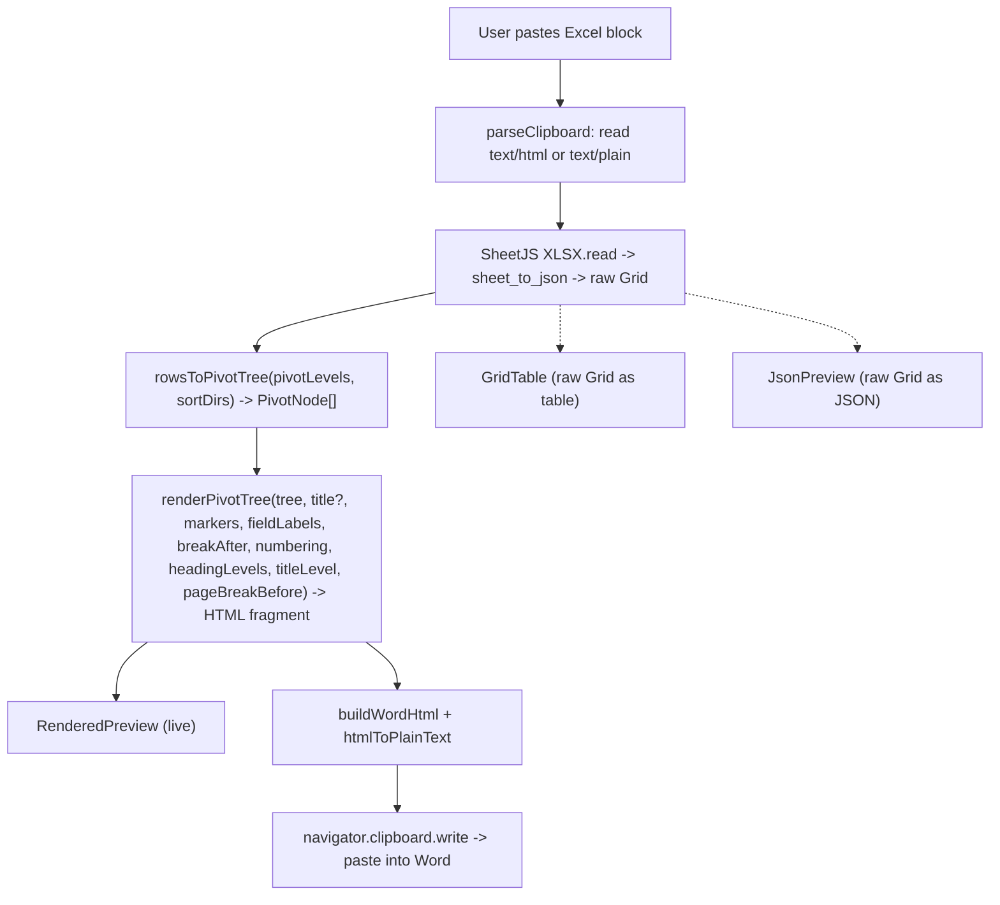

# Architecture

## Core data model

The product is a recursive **pivot tree**, not a flat table (see [`lib/types.ts`](../lib/types.ts)):

```ts
PivotNode {
  lines: PivotLine[]      // the fields at one indent level (>=1, stacked)
  children: PivotNode[]   // leaf = []
}
PivotLine { col, name, value }   // label `name` (header) + `value`, kept SEPARATE + raw
```

The parser produces a raw **Grid** (`Cell[][]`); `rowsToPivotTree` turns it into a recursive `PivotNode` tree. The builder caps indent depth at **9 levels** (`MAX_LEVELS`, the most Word renders), so beyond it a new field stacks into the deepest level rather than making a 10th. The pivot structure is an ordered list of **indent buckets** — each bucket is one indent level holding one or more fields. A node's `lines` are that level's fields stacked at the same indent (each keeps its label `name` and `value` separate so the renderer can show/hide/format the label); rows whose values match across all of a level's fields merge into one node (composite group key). The title and any level marked as a **Word heading** (`headingLevels`) map to real Word Heading styles; everything else — including any app-drawn multilevel numbers — is styled body text.

Multiple pasted tables are held as a `TableState[]` in `components/PasteInput.tsx`; each `TableState` carries its own grid, `pivotLevels` (`number[][]` — the ordered indent buckets), `markers`, `fieldLabels` (`Record<col, FieldLabel>` — per-field label show/bold/italic/underline), `sortDirs` (`Record<col, "asc"|"desc">` — per-field sort of sibling groups), `breakAfter` (`boolean[]` — a single on/off "blank line between top-level groups", `[true]` or `[]`), `numbering` (`{ mode: "off"|"custom"|"multilevel", start, levels }` — the Markers control: off = no marker or number, custom = each level's own marker symbol, multilevel = app-drawn static numbers with `levels` showing/hiding the number per indent level), `headingLevels` (`boolean[]` — levels mapped to a Word heading: nav pane + collapsible, Word-numbered), `headingRanks` (optional `number[]` — per-level override of WHICH `Heading K` a checked level maps to, 1–9; 0/absent = auto-contiguous), `sectionTitle`, and two more optional fields: `headerRow` (0-based index of the header row, default 0 — everything reads `bodyGrid(t) = grid.slice(headerRow)` so banner/title rows above the header are ignored; it only drops leading *rows*, so the column-keyed `pivotLevels`/`fieldLabels`/`sortDirs` stay valid) and `pageBreakBefore` (when on, each top-level group after the first starts on a new Word page). Both are optional, so older `localStorage` sessions / `.json` imports stay compatible (consumers use `?? default`). `components/tableModel.ts` `tableToHtml(t, titleLevel)` runs the per-table nest→render pipeline on `bodyGrid(t)` (threading `sortDirs` into the mapper, `breakAfter`/`numbering`/`headingLevels`/`titleLevel`/`pageBreakBefore` into the renderer) and is the single source used by both the right-pane preview and the per-section export, so both stay identical.

**Arrangement reuse.** On ingest, `ingestGrid` compares the new grid's `headerSignature` (trimmed, case-insensitive header names in order — order-sensitive because the arrangement is column-indexed) against every existing section's EFFECTIVE header (`bodyGrid(t)[0]`); the first arranged match (`pivotLevels.length > 0`) sets an `arrangeHint` that renders as a dismissible banner ("headers match *Table N* — reuse its arrangement?"). **Apply** `structuredClone`s the source's `pivotLevels`/`markers`/`fieldLabels`/`sortDirs`/`breakAfter`/`numbering`/`headingLevels`/`headingRanks`/`pageBreakBefore` onto the new section — never the grid, title, or `headerRow` (the new paste may lack the old banner rows) — as one clean undo step. Guards make the banner vanish if either section is removed/undone; the hint clears on apply, dismiss, or the next paste.

## The pivot view (how a Grid becomes a tree) — `rowsToPivotTree`

Row 0 is field names. You arrange fields into an **ordered list of indent buckets** (`pivotLevels: number[][]`): bucket 1 is the outermost level, within each group nest by bucket 2, and so on. A bucket can hold **one or more** fields — fields stacked in one bucket render at the same indentation and form a **composite group key**, so rows merge into one node only when they match across every field in that bucket. Each line is labelled `Field name: value`; per field, the label (`Field name: `) can be hidden, bolded, or underlined (`fieldLabels`), leaving just the value. A per-field **sort** (`sortDirs`) reorders the sibling groups at that field's level (ascending/descending, numeric + text aware via `localeCompare` with `numeric:true`); off keeps first-seen order. A per-table **Markers** control (a 3-mode dropdown: **Off** = no markers or numbers / **Custom** = each level's own bullet/number symbol / **Multilevel** = app-drawn static numbers; default Custom) sets the body's marker style. In **custom** mode a per-level marker picker chooses each level's bullet/number style (only the first field of a multi-field level is marked); **off** shows neither marker nor number. In **multilevel** mode the renderer instead prefixes each node's first line with an app-drawn static number from a chosen `start` (a dotted-decimal string = the exact first item number; `5.1` → `5.1.1` → `5.1.1.1`) and suppresses that node's marker; a per-level checkbox (`numbering.levels`) hides a level's number, making it TRANSPARENT — its children continue the nearest shown level's sequence, so the numbers follow the gap (`5.1` → `5.1.1`, `5.1.2`, never a number under a hidden parent) with no collisions (`multilevelNumbers`). A single **Blank line between top-level groups** checkbox beside the Markers control (`breakAfter` = `[true]`/`[]`, no longer per-level) pushes a spacer paragraph after each top-level group's whole subtree, and a **New page per group** checkbox (`pageBreakBefore`) marks the first line of each top-level group after the first with `data-break="1"`, which `buildWordHtml` turns into a `page-break-before:always`. Blank cell → `(blank)`; first-seen order preserved at every level (before sorting).

```
1. Item Category: Fruit
   a. Item Name: Apple
        i. Item Qty: 16             ← bucket 3 holds three fields,
           UID: AVASCASC               stacked at one indent
           Item Description: Lorem…
   b. Item Name: Banana
        …
2. Item Category: Meat
   …
```

Output is a `PivotNode[]` (recursive; the builder caps indent depth at 9 levels; each node carries its level's `lines`). The optional **Section title** renders as `<p class="ws-title">` and the nested rows as `<p class="ws-lvl" data-level="N">` (depth clamped at 9); a "blank line after" spacer is an extra `<p class="ws-lvl" data-level="N">&#160;</p>` after a node's subtree (an nbsp so Word keeps it; no marker/number/label). When numbering is on, a node's first line is prefixed with its compounded number as plain escaped body text (the number replaces the marker). A level the user marks as a **Word heading** tags its first line `data-heading="K"` — K is **sequential by default**: one rank under the previous heading level (the title — gated on a title actually existing — then each heading-checked level in depth order, **pinned values included**, clamped 9), so checking levels 1 and 4 gives H2 → H3 under a Heading-1 title (never a skipped H2 → H5 outline) and pinning a level re-derives the autos beneath it (pin H1 → the next auto is H2). An explicit `headingRanks[depth-1]` (1–9; 0/absent = auto) **overrides** the rank for templates whose numbering keys off a specific heading (several levels may share one rank) — a pin is the only way a rank gap can occur. The matrix's Heading checkbox shows the resulting rank as a small **chip-dropdown** (Auto / pin H1–H9, amber-tinted when a manual pick skips a rank — Word's accessibility checker flags gapped outlines), and that level's Marker/Number cell collapses to a *Word numbers* note (its own marker/number is suppressed, so a live control would lie). `buildWordHtml` maps the **title** (and any heading-marked levels) to the destination `Heading 1`/`Heading K` styles when set (a Use-Destination-Styles or default Ctrl+V paste adopts them — `5.0`, `5.1` — so the heading rows enter the nav pane and become collapsible; Keep Source Formatting keeps the preview look instead); every other body row (spacers, numbered/markered lines) uses the app's direct per-level styling, so the Word output matches the live preview. With a title the nested data starts at level 2; without one, level 1. The Structure picker builds the buckets (an indented list drawn with Windows-Explorer-style tree connector lines │ ├ └ — reordered/indented only via ◄ outdent / ► indent / ▲ ▼ reorder / ✕ remove buttons, with a live **N/9 levels** chip + at-cap warning enforcing the 9-level ceiling — plus the Add-fields pool), the per-field label toggles (Aa show/hide, B bold, I italic, U underline), and the per-field sort (↕/↑/↓). Below Structure, a per-level **matrix** (one row per indent level, aligned to the same numbered pill) carries each level's Marker/Number cell (a **Marker** select in Custom mode, a **Show number** checkbox in Multilevel mode, hidden in Off mode), a **Word heading** checkbox, and a **Look** cell (a color swatch + an **Aa** popover with font / size / bold) — one matrix replacing the former separate Markers / Number-level / Word-heading lists AND absorbing the per-depth appearance list into its Look column; the blank-line control is now a single **Blank line between top-level groups** checkbox beside the Markers dropdown (`breakAfter` = `[true]`/`[]`), no longer a per-level matrix column. The Look column edits the shared per-depth body look (GLOBAL, all tables — tinted + labeled to set it apart from the per-table Marker / Heading columns; the per-depth slot is `bucket + (sectionTitle ? 1 : 0)`, matching the renderer), while only the document-wide body font, indent step, and Reset-levels controls sit in a compact **⚙ Document** popover in the top command band, badged *All tables*. `PasteInput` owns the styling state; it threads only the per-depth level styles to `TableCard` as a slimmed `appearance` prop (`{ levelStyles, onLevelChange }`; `LevelInput`/`DEFAULT_LEVEL` live in `components/tableModel.ts`) for the Look column and drives body font / indent / reset itself in the Document popover, so level styles stay global-by-depth while markers/heading/blank-line/numbering stay per-table. A dependency-free `Popover` helper (`components/Popover.tsx`) anchors both each Look panel and the Document popover, and `TableCard` exports `FONTS` (the allow-listed font list) for `PasteInput` to reuse.

## Data flow

```
clipboard (text/html, else text/plain)
  -> SheetJS XLSX.read({ type: "string" })
  -> sheet_to_json({ header: 1, blankrows: false, defval: "", raw: false })   -> raw Grid
  -> dropEmptyColumns(grid)   (strip fully-blank spacer columns on ingest)      -> append a TableState
  -> tableToHtml(t, titleLevel):
       rowsToPivotTree(bodyGrid(t), pivotLevels, sortDirs)   (bodyGrid = grid.slice(headerRow); build first-seen, then sort-post-pass)
         -> renderPivotTree(tree, title?, markers, fieldLabels, breakAfter, numbering, headingLevels, titleLevel, pageBreakBefore)  -> HTML fragment
  -> live preview (RenderedPreview, dangerouslySetInnerHTML; scoped [data-level] CSS)
  -> buildWordHtml + htmlToPlainText -> navigator.clipboard.write             -> paste into Word
```

**Copy section** is the export: it runs the active table's `tableToHtml` fragment through **one** `buildWordHtml` (a single `@page`) and writes it to the clipboard — each section is its OWN standalone Word document, not stacked with the others (there is no combined "Copy all", and no combined "All sections" preview). **Ctrl/Cmd+Enter** triggers it from anywhere (a window keydown listener with the same latest-handler-ref pattern as paste-anywhere — the mouse-free way out, pairing with paste-anywhere's way in). `tableToHtml` also powers the live preview, so preview and export stay identical. On success `copySection` sets a `copyNote` that renders as a visible + `aria-live` banner ("Section copied." + the Keep-Source-vs-Use-Destination paste guidance); `renderPivotTree` escapes all user-derived text (`& < >`). The **Table** view (`GridTable`) shows the raw parsed Grid as an actual HTML table (as pasted, before restructuring), and the **JSON** view shows the same Grid as raw JSON — both instead of the rendered tree. (The former in-view **Header row** picker was removed by request; a legacy session's stored `headerRow` is still honored on read via `bodyGrid`.)

**Persistence.** `PasteInput` memoizes a `SessionSnapshot` (`{tables, levelStyles, bodyFont, indentInput, headingStyleName, titleInput, activeId}`) and writes it to `localStorage` via `lib/persistence.ts` (versioned envelope) — debounced 400ms, plus a synchronous flush on `pagehide`/`visibilitychange` — and rehydrates once on mount behind a `hydrated` gate (re-seeding the `idRef` id counter past the largest restored id, so the first client render matches the empty server render and there’s no hydration mismatch). It is local-only; nothing is uploaded. **Undo/redo covers every change** — an effect observes the `SessionSnapshot` memo and records a step whenever a workspace field other than `activeId` changes (coalescing rapid bursts via a short debounce), with `Ctrl+Z` / `Ctrl+Y` and persistent toolbar buttons; **duplicate** (`duplicateTable`, a `structuredClone` spliced in after the source) and **paste-anywhere** (a window `paste` listener, `ingestClipboard`, that ingests unless a text field is focused) both run through the same state so they're captured too; **Try an example** injects `makeExampleTable`. `newTable(id, grid)` in `components/tableModel.ts` is the one default-`TableState` factory shared by paste and the example.

## Clipboard output

`lib/clipboard.ts` wraps the rendered fragment for Word and applies the styling:
- `buildWordHtml(fragment, heading, bodyFont)` → an Office-namespaced `<html>` with `ProgId`/`Generator`/`Originator` metas (what Word's own clipboard writer emits — marks the payload as WORD-DOCUMENT content so Word offers its between-documents paste options, incl. **Use Destination Styles**, even in a blank destination where no conflicting style is in use), a `<style>` (`@page`, body font, the heading rules actually used) and `<body>{rewritten fragment}`. **Heading mapping is by REAL `<h1>`–`<h6>` elements whose rule declares the FULL source look** — the mechanics were verified empirically against desktop Word (COM paste matrix, July 2026): (1) a **Use Destination Styles** or **default Ctrl+V** paste maps `<hK>` to the built-in `Heading K` in a blank doc AND a template (an alias like `1.0 HEADING` resolves) — everything DECLARED in the `hK` CSS rule is treated as the source style's DEFINITION and swapped wholesale for the destination style (clean adoption), while anything NOT declared falls back to Word's HTML h-defaults and rides along as polluting DIRECT formatting (a bare `<h1>` pastes as Heading 1 + direct bold 24pt) — so each rule declares `mso-style-name`/`mso-outline-level` PLUS the level's color/font/size and bold; (2) a **Keep Source Formatting** paste never maps named styles — the row lands as **Normal** with `mso-outline-level` as direct formatting (still in the nav pane, the deceptive half-working symptom) and the declared rule look IS the visible formatting, so KSF now shows the preview's bold heading look instead of naked body text (this was the original blank-doc bug: heading rows carried no look at all, so a KSF paste produced plain Normal text); (3) **Merge Formatting** strips both the mapping and the outline level — the copy banner warns against it. The paste never redefines the destination's own Heading styles. **The title:** when `headingStyleName` is a built-in `Heading 1–6` (all the dropdown offers) it becomes `<hN>` (N via `headingLevel(name)`, so Heading 2/3/4 land at the right outline depth); any other non-empty name keeps the legacy `<p class="MsoTitle">` + `mso-style-name:"<name>";mso-outline-level:<N>` rule. Either way `wrapTitleOnHeading` layers the user's FULL `titleStyle` Look on top as inline direct formatting — one `<span style="font-family;font-size;color;font-weight">` (the explicit `font-weight` sets bold in BOTH directions, so it can also un-bold an intrinsically-bold heading) wrapped by `<i>`/`<u>` runs — so the mapped title's appearance pastes EXACTLY as previewed. Word supplies ONLY the heading's auto-NUMBER, its outline/nav-pane entry, its paragraph spacing, and any ALL-CAPS font effect (the number and all-caps are the two things inline HTML cannot override while mapped). Blank → the app's own `titleStyle` look inline in full. **Heading-marked rows** (`data-heading="K"`) become `<hK>` for K ≤ 6, so they enter the destination outline (nav pane + collapsible) and Word numbers them — in blank docs and templates alike; K 7–9 (no HTML tag) keep `<p class="MsoHeadingK">` with the same rule declarations (the class route maps on the same Use-Destination-Styles/default pastes — and, like the tag route, never under KSF). Each heading rule's declared look is the LEVEL's look (keyed by the row's `data-level`, same as the preview's heading rows; the mapped title's rule declares `titleStyle`). Style rules are emitted only for what the fragment actually used (a blank title adds no stray `p.MsoTitle` rule). **Every other body row** (including spacer paragraphs and any app-drawn multilevel numbers, which are already plain text in the fragment): a `<p>` with **inline** direct formatting — `heading.levels[N-1]` (color/font/size) + left-indent + compact spacing (`margin:0`, `line-height:115%`) — with `<b>`/`<i>`/`<u>` runs for the label per `fieldLabels` (underline wraps just the name, not the `: ` separator). A row carrying `data-break="1"` (a top-level group starting a new page under **New page per group**) also gets `page-break-before:always` — appended to the body paragraph's inline style, or added as a `style=` alongside the `MsoHeadingK` class when that same row is also a Word heading. The body-row regex is `data-level="([1-9])"( data-break="1")?(?: data-heading="([1-9])")?`. Inline (not a CSS class) is the key: a Use-Destination-Styles paste discards class/style-name formatting it can't map (resetting unknown classes to Normal, dropping bold and bringing Normal's space-after) but keeps inline direct formatting + inline runs, so the per-level look, tight spacing, and label bold/italic/underline survive and match the live preview. The browser writes the Windows CF_HTML header automatically.
- `htmlToPlainText(fragment)` → readable plain-text fallback for the `text/plain` flavor.

`HeadingStyle = { levels: LevelStyle[]; indentStep: number; headingStyleName: string; titleStyle: TitleStyle }` is the single styling source, built once in `PasteInput` (its per-level look is edited inline in the matrix's **Look** column in `TableCard`'s Levels group, and its body font / indent / reset in the **⚙ Document** popover in `PasteInput`'s top command band, badged *All tables*) and shared by every table — `headingStyleName` is the Word style name for the title (default `Heading 1`, options `None`/`Heading 1–4`; blank/`None` = the app's own `titleStyle` look inline). `PasteInput` turns that name into a number via `headingLevel(headingStyleName)` (1–9, or 0 for None) and threads it as `titleLevel`, so a mapped title lands at its chosen `mso-outline-level` (Heading 2/3/4 give a correct outline, not a hardcoded 1) and its full `titleStyle` Look (font/size/color/bold/italic/underline) applies inline on top, while body-heading rows nest at `titleLevel + depth`. `levels` is the direct per-level look (Arial 11 black) used for body rows, `titleStyle` is the shared title look, and `indentStep` (inches) is the left-indent per nesting level. The parent's `copySection()` goes through `tableToHtml(t)` for the active table (the same source as the live preview, so preview and export stay identical) and writes a `ClipboardItem` with both flavors via `navigator.clipboard.write`. Export is clipboard-only (no download), per section.

## Out of scope

- **`.docx` generation** — export is HTML-on-clipboard only.

## Pipeline diagram


